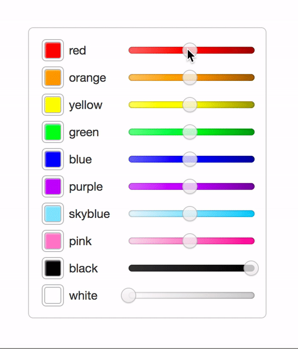

[](https://travis-ci.org/ax5ui/ax5ui-palette)
[](https://badge.fury.io/js/ax5ui-palette)
[](https://www.npmjs.com/package/ax5ui-palette)

# ax5ui-palette
"palette" to easily select predefined colors. also choose the color you want by adjusting the brightness of the color.



> *Dependencies*
* _[jQuery 1.X+](http://jquery.com/)_
* _[ax5core](http://ax5.io/ax5core)_
* _[bootstrap](http://getbootstrap.com/)_


### Install with bower
```sh
bower install ax5ui-palette
```
[bower](http://bower.io/#install-bower) is web front-end package manager.
When you install `bower`, it will be installed under the `bower_components` folder to resolve the plug-in dependencies.  
(You can change the folder location. [.bowerrc](http://bower.io/docs/config/#bowerrc-specification) )

It is recommended that you install by using `bower`. 
If you've never used bower, please refer to [http://bower.io/#install-bower](http://bower.io/#install-bower).

### Install with npm
If you do not use bower, it also can be installed by using npm as an alternative.
In case of npm, which is the package manager for the front end, you need to solve the problem of plug-in dependencies.

```sh
npm install jquery
npm install ax5core
npm install ax5ui-palette
```

After downloading the install file of npm, you will need to copy it to the location where you want to use as a resource for the project.
If the copy process is inconvenient, it also can be done easily by using `gulp` or `grunt`.

### Download code
- [ax5core Github releases](https://github.com/ax5ui/ax5core/releases)
- [ax5ui-palette Github releases](https://github.com/ax5ui/ax5ui-palette/releases)

### Insert "ax5palette" in HTML HEAD.
Folder location can be any for your project. However, please be sure to assign the right path in the project.

```html
<link rel="stylesheet" type="text/css" href="https://cdn.rawgit.com/ax5ui/ax5ui-palette/master/dist/ax5palette.css">
<script src="https://cdnjs.cloudflare.com/ajax/libs/jquery/1.12.4/jquery.min.js"></script>
<script type="text/javascript" src="https://cdn.rawgit.com/ax5ui/ax5core/master/dist/ax5core.min.js"></script>
<script type="text/javascript" src="https://cdn.rawgit.com/ax5ui/ax5ui-palette/master/dist/ax5palette.min.js"></script>
```
***

**CDN urls**
This is a list of CDN urls for ax5ui-palette. ax5ui offers the CDN services through the rawgit.
```
https://cdn.rawgit.com/ax5ui/ax5ui-palette/master/dist/ax5palette.css
https://cdn.rawgit.com/ax5ui/ax5ui-palette/master/dist/ax5palette.js
https://cdn.rawgit.com/ax5ui/ax5ui-palette/master/dist/ax5palette.min.js
```

### Basic Usage
```html
<div style="border:1px solid #ccc;border-radius: 6px;padding: 20px;width: 290px;">
    <div data-ax5palette="01" style="height:500px;width:250px;"></div>
</div>
```
```js
var myPalette = new ax5.ui.palette({
    target: $('[data-ax5palette="01"]'),
    onClick: function (hexColor) {
        console.log(hexColor);
    }
});
```

- - -


### Preview
- [See Demonstration](http://ax5.io/ax5ui-palette/demo/index.html)

If you have any questions, please refer to the following [gitHub](https://github.com/ax5ui/ax5ui-kernel)

## Question
- https://jsdev.kr/c/axisj/ax5ui
- https://github.com/ax5ui/ax5ui-kernel/issues

[](https://github.com/axisj) 
